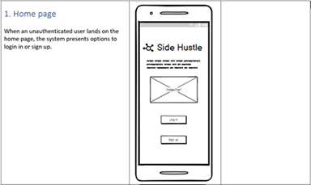
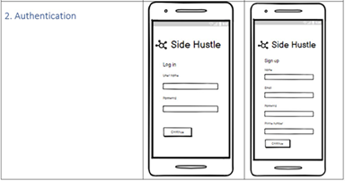
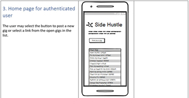
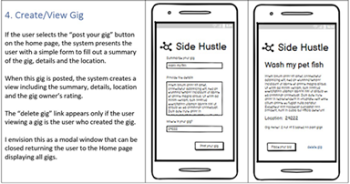
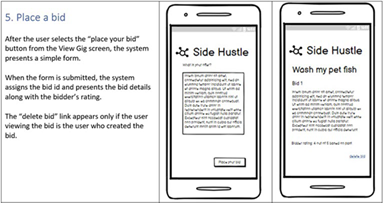
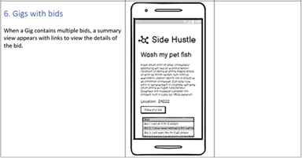
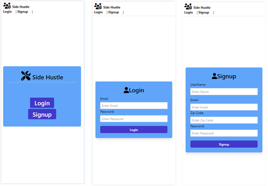
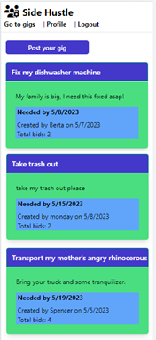
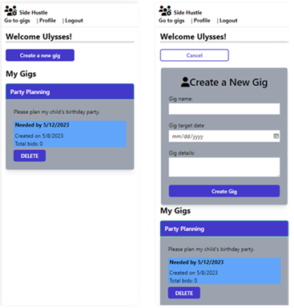
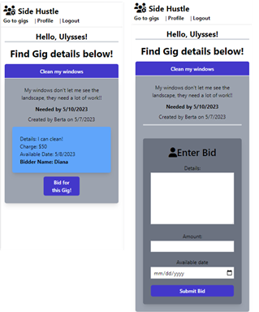

# Interactive Full-Stack Application: Side Hustle

## Table of Contents:
- [Description](#description)
- [Deployed Application](#deployed-application)
- [License](#license)
- [Requirements](#requirements)
- [User Stories](#user-stories)
- [Wireframes](#wireframes)
- [Visuals](#visuals)
- [The Project Team](#the-project-team)

## Description:
Side Hustle is a full-stack application that connects individuals needing temporary assistance with those eager to provide it and earn some extra money. This innovative platform helps authenticated users post, view, and bid on gigs quickly and confidently.

Finding reliable, trustworthy help or work is easy with Side Hustle. Whether you're a student looking for a quick gig to help pay your bills or a homeowner needing extra hands to complete a project, Side Hustle has you covered. By connecting you with like-minded individuals in your community, Side Hustle makes it easy to find the help you need when you need it.

As an authenticated user, you can quickly and easily post a gig on the platform, detailing the specific help you need. Alternatively, if you're looking to earn some extra cash, you can browse through a wide range of gigs and place a bid on the ones that interest you.

Side Hustle requires authentication for all users, ensuring a safe and secure platform for those hiring and those for hire.

## Deployed Application:

You may view the deployed application with Heroku at [https://side-hustle.herokuapp.com/](https://side-hustle.herokuapp.com/).

## License:

## Requirements

- [✓] Use Node.js and Express.js to create a RESTful API.
- [✓] Use Handlebars.js as the template engine.
- [✓] Use MySQL and the Sequelize ORM for the database.
- [✓] Have both GET and POST routes for retrieving and adding new data.
- [✓] Use at least one new library, package, or technology that we haven’t discussed. This project team used Tailwinds CSS for the new technology.
- [✓] Have a folder structure that meets the MVC paradigm.
- [✓] Include authentication (express-session and cookies).
- [✓] Protect API keys and sensitive information with environment variables.
- [✓] Be deployed using Heroku (with data).
- [✓] Have a polished UI.
- [✓] Be responsive.
- [✓] Be interactive (i.e., accept and respond to user input).
- [✓] Meet good-quality coding standards (file structure, naming conventions, follows best practices for class/id naming conventions, indentation, quality comments, etc.).
- [✓] Have a professional README (with unique name, description, technologies used, screenshot, and link to deployed application).

## User Stories:

### Gigger
AS someone needing a small job done
I WANT a simple bulletin-style online gig board
SO THAT I can post a gig to hire short-term help.

### Bidder
AS someone looking for side gigs
I WANT a simple bulletin-style online gig board
SO THAT I can bid on a gig to get a short term job.

## Wireframes

## Visuals

as of May 8, 2023

### Visual 1: (Left) The landing page for unauthenticated user | (Middle) Login prompt | (Right) Signup prompt 

### Visual 2: An authenticated user views a list of gigs with a call to action to create a gig.

### Visual 3: (Left) Authenticated user's profile page includes gigs they've posted with a call to action to create a gig. Users may delete their own gigs. (Right) The create a new gig form appears when the user selects the button

### Visual 4: (Left) A user may view gig details with a call to action to bid for the gig | (Right) The create bid form appears when the user selects the button

## The Project Team:

If you have questions or want to contribute, contact us through Github. 

- [Diana Castro](https://github.com/dimartoro)
- [Kevin Coffield](https://github.com/Nephew20)
- [PJ Davidian](https://github.com/peejd)
- [Spencer Hill](https://github.com/dspnc)
- [Virginia Butler](https://github.com/vwbutler)
 

